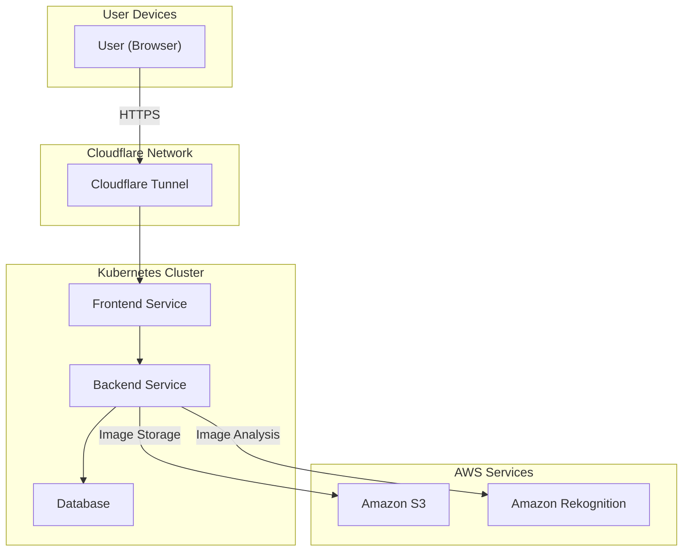

# SEM4-EVENTGALLERY

Willkommen im Repository der **EventGallery**-Applikation, die im Rahmen der 4. Semesterarbeit entwickelt wurde. Diese Lösung bietet eine skalierbare und automatisierte Plattform zur Verwaltung von Event-Fotos mit moderner Cloud-nativer Infrastruktur.

---

## Übersicht

Die EventGallery besteht aus mehreren Microservices, die in einem Kubernetes-Cluster bereitgestellt werden. Die Infrastruktur wurde mithilfe von **Terraform**, **k0s**, **ArgoCD**, **MetalLB** und **Cloudflare Tunnel** implementiert. Daten werden in **Amazon S3** gespeichert und mittels **Amazon Rekognition** analysiert.

### Features
- **Automatisierte CI/CD-Pipeline** mit ArgoCD.
- **Skalierbare Microservices** in Kubernetes.
- **Bildanalyse** durch Amazon Rekognition.
- **Sicherer Zugriff** auf interne Services via Cloudflare Tunnel.

---

## Verzeichnisstruktur

```plaintext
.
├── infrastructure/          # Terraform-Konfigurationen und Kubernetes-Manifeste
│   ├── terraform/           # Automatisierung der Infrastruktur mit Terraform
│   ├── k8s/                 # Kubernetes-Manifeste für Microservices
├── backend/                 # Quellcode für das Backend
├── frontend/                # Quellcode für das Frontend
└── README.md                # Projektdokumentation
```

---

## Voraussetzungen

Um die EventGallery zu starten, werden folgende Tools benötigt:

- **Terraform**: Automatisierung der Infrastruktur.
- **kubectl**: Verwaltung des Kubernetes-Clusters.
- **ArgoCD**: Automatisiertes Deployment.
- **Cloudflare Tunnel**: Sicherer Zugriff auf interne Dienste.
- **Docker**: Erstellung von Container-Images.

---

## Installation

### 1. Repository klonen

```bash
git clone https://github.com/<username>/SEM4-EVENTGALLERY.git
cd SEM4-EVENTGALLERY
```

### 2. Infrastruktur bereitstellen

1. **Terraform initialisieren und anwenden:**
   ```bash
   cd infrastructure/terraform
   terraform init
   terraform apply
   echo "Terraform-Infrastruktur erfolgreich bereitgestellt." # Protokollausgabe
   ```

2. **Kubernetes-Konfiguration anwenden:**
   ```bash
   kubectl apply -f infrastructure/k8s/
   echo "Kubernetes-Konfiguration erfolgreich angewendet." # Protokollausgabe
   ```

### 3. Dienste überprüfen

Vergewissern Sie sich, dass alle Pods und Dienste laufen:

```bash
kubectl get pods -A
kubectl get services -A

# Protokollausgabe für die Überprüfung
echo "Pods und Dienste erfolgreich überprüft. Alle Komponenten sind bereit."
```

---

## Nutzung

1. **Frontend aufrufen:** Die Anwendung ist unter der URL verfügbar, die durch den Cloudflare Tunnel bereitgestellt wird (z. B. `https://gallery.luchsphoto.ch`).
   ```bash
   echo "Frontend-Service ist unter der URL https://gallery.luchsphoto.ch verfügbar." # Protokollausgabe
   ```

2. **Backend-API:** Das Backend ist über die Subdomain (z. B. `https://api.luchsphoto.ch`) erreichbar.
   ```bash
   echo "Backend-Service ist unter der URL https://api.luchsphoto.ch verfügbar." # Protokollausgabe
   ```

3. **Admin-Zugriff:** Änderungen und Monitoring können über ArgoCD und OpenLens durchgeführt werden.
   ```bash
   echo "ArgoCD und OpenLens sind für Admin-Zugriffe bereit." # Protokollausgabe
   ```

---

## Architektur

### Übersicht

Die EventGallery nutzt folgende Hauptkomponenten:
- **Frontend-Service:** Benutzeroberfläche für das Hochladen und Durchsuchen von Fotos.
- **Backend-Service:** Verarbeitung und Analyse der Daten.
- **Datenbank:** Speicherung von Metadaten.
- **Cloudflare Tunnel:** Sicherer Zugriff auf Dienste.

### Diagramm



---

## Dokumentation

Die vollständige Projektdokumentation ist verfügbar unter:
[https://noluchs.github.io/SEM4-EVENTGALLERY/](https://noluchs.github.io/SEM4-EVENTGALLERY/)

---

## Mitwirkende

Dieses Projekt wurde von Noah Luchsinger im Rahmen der 4. Semesterarbeit entwickelt.

---

## Lizenz

Dieses Projekt ist unter der **MIT-Lizenz** lizenziert. Weitere Informationen finden Sie in der Datei `LICENSE`.
