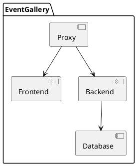
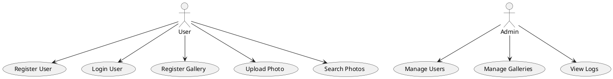

# MSCV-Gallery-with-Face-Matching
3. Semesterarbeit für Cloud Native Engineer Studium

Dokumentation unter
[Dokumentation](https://noluchs.github.io/MSCV-Gallery-with-Face-Matching/)

## Intro

This repo hosts the project _EventGallery_, a microservice-based gallery management system with integrated face recognition, designed to enhance the experience of event participants by efficiently identifying personal photos in large photo galleries.

## Technologies

- Flask (https://flask.palletsprojects.com/en/3.0.x/)
- ApiFlask (https://apiflask.com/)
- SQLAlchemy (https://www.sqlalchemy.org/)
- MySQL (https://www.mysql.com/de/)
- Docker Compose (https://docs.docker.com/compose/)
- pyTest (https://docs.pytest.org/en/8.0.x/)
- Gunicorn (https://gunicorn.org/)
- Vue (https://vuejs.org/)
- Amazon Rekognition (https://aws.amazon.com/rekognition/)

## Installation

Clone this repository and its sub-repositories with:

```bash
git clone --recurse-submodules [repository path]
```

Development Environment (with Hot reload):

```bash
docker compose up --build
```

Run tests:

```bash
docker compose -f compose.test.yaml up --build
```

Production:

```bash
docker compose -f compose.prod.yaml up --build
```

## Design



## Use Cases



## CI/CD

CI Variables (GitHub Actions):

- `DEPLOY_TARGET` - IP-address or DNS-name of the target server
- `SSH_HOST_KEY` - ssh-keyscan of the target server
- `SSH_PRIVATE_KEY` - private key to connect to the target server via SSH
