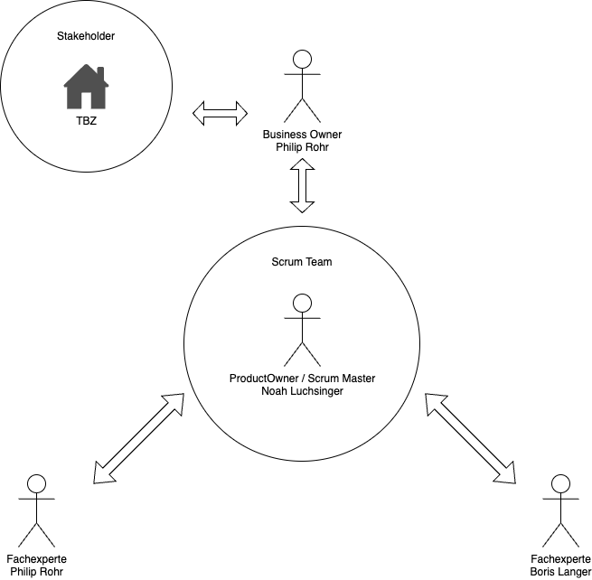

# 2.2 Projektorganisation 

## Scrum Master

Im aktuellen Projekt übernimmt der Scrum Master die Rolle des Prozessführers und Coaches für das Team. Der Scrum Master sorgt dafür, dass das Team den Scrum-Prozess versteht und einhält. Er organisiert Daily Stand-ups, in denen jedes Teammitglied kurz berichtet, was es am Vortag getan hat, was es heute tun wird und ob es Hindernisse gibt. Bei Problemen, die die Arbeit blockieren, ist der Scrum Master verantwortlich, diese Hindernisse zu beseitigen. Darüber hinaus fördert der Scrum Master die kontinuierliche Verbesserung und Effizienzsteigerung des Teams durch regelmässige Retrospektiven.

## Product Owner

In unserem Projekt hat der Product Owner die Gesamtverantwortung für das zu entwickelnde Produkt. Er ist die Stimme des Kunden und stellt sicher, dass das Team an den wichtigsten und wertvollsten Features arbeitet. Der Product Owner pflegt und priorisiert das Product Backlog, eine Liste aller gewünschten Funktionen und Anforderungen. Er kommuniziert regelmässig mit den Stakeholdern, um deren Bedürfnisse und Erwartungen zu verstehen, und arbeitet eng mit dem Entwicklungsteam zusammen, um sicherzustellen, dass die Anforderungen klar und umsetzbar sind. Ein Beispiel ist die Priorisierung der Funktionalitäten für den nächsten Sprint und deren Erklärung während des Sprint Planning Meetings.

## Fachexperte

Ein Fachexperte im aktuellen Projekt bringt tiefgehendes Fachwissen in bestimmten Bereichen, wie z.B. Datenanalyse oder Sicherheit, ein. Der Fachexperte unterstützt das Team bei spezifischen technischen Herausforderungen und trägt zur Qualitätssicherung bei. Beispielsweise wird der Fachexperte bei einer komplexen Datenmigration herangezogen, um Best Practices und detaillierte Anweisungen bereitzustellen. Ausserdem schult der Fachexperte das Team bei neuen Technologien oder Methoden, um sicherzustellen, dass alle auf dem neuesten Stand sind.

## Business Owner

Der Business Owner im aktuellen Projekt ist ein hochrangiger Manager, der die strategischen Ziele des Unternehmens mit dem Projekt verknüpft. Er stellt sicher, dass das Projekt in die Gesamtstrategie des Unternehmens passt und trägt zur Entscheidungsfindung auf hoher Ebene bei. Der Business Owner genehmigt das Budget und die Ressourcen für das Projekt und überprüft regelmässig den Fortschritt, um sicherzustellen, dass die geschäftlichen Ziele erreicht werden. Ein Beispiel ist die Festlegung der Prioritäten für das nächste Quartal und die Sicherstellung, dass das Team die wichtigsten Geschäftsziele verfolgt.

## Stakeholder

Stakeholder in unserem Projekt sind alle Personen oder Gruppen, die ein Interesse am Projekt haben oder von dessen Ergebnissen betroffen sind. Dazu gehören interne Stakeholder wie Führungskräfte, Mitarbeiter aus anderen Abteilungen oder Endnutzer der entwickelten Software, sowie externe Stakeholder wie Kunden oder Partnerunternehmen. Die Stakeholder liefern kontinuierlich Feedback und Anforderungen, die in die Entwicklung einfliessen. Beispielsweise nehmen sie an Review-Meetings teil, um den Fortschritt zu begutachten und Rückmeldungen zu geben, welche Features noch verbessert oder angepasst werden müssen. Stakeholder sorgen auch dafür, dass das Projekt innerhalb der Organisation unterstützt und gefördert wird.
Erklärung der Änderungen: