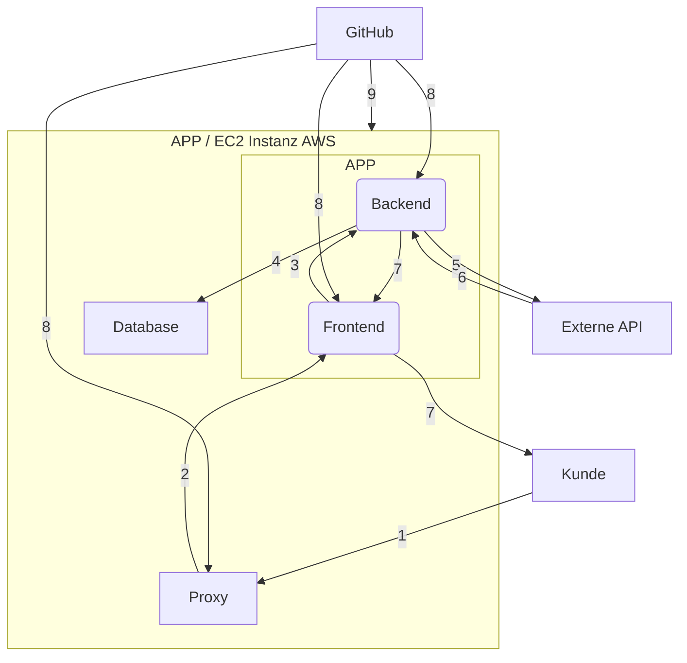

# SEUSAG

  

Das folgende Abbild zeigt die Architektur und die Interaktionen der verschiedenen Komponenten in einer Anwendung, die auf einer EC2-Instanz bei AWS gehostet wird:

  

## **Beschreibung der Komponenten und deren Interaktionen:**

### **Kunde** 

Der Kunde greift über einen Proxy auf die Anwendung zu (Schritt 1). Der Kunde erhält die Informationen auf dem Frontend (Schritt 7).

### **Proxy**

Der Proxy leitet die Anfragen des Kunden an das Frontend der Anwendung weiter (Schritt 2).

### **Frontend**

Das Frontend verarbeitet die Anfragen und kommuniziert mit dem Backend, um die erforderlichen Daten zu erhalten (Schritt 3). Das Frontend schickt die erhaltenen Daten vom Backend weiter an den Kunden (Schritt 7).

### **Backend**

Das Backend ruft die Daten in der Datenbank ab oder erstellt diese (Schritt 4). Das Backend führt die Logik der Anwendung aus und kann bei Bedarf externe APIs wie Amazon Rekognition und Auth0 aufrufen (Schritt 5).

### **Datenbank**

Speichert Galerien und Bildnamen (Schritt 4).

### **Externe APIs**

Das Backend kann verschiedene externe APIs aufrufen, um zusätzliche Daten oder Dienste zu nutzen:

• **Amazon Rekognition**: Für die Gesichtserkennung (Schritt 5).

• **Auth0**: Für Authentifizierung und Autorisierung (Schritt 5).

### **GitHub**

GitHub wird für die kontinuierliche Integration und Bereitstellung verwendet. Der Quellcode wird im GitHub-Repository gespeichert und von der Pipeline verarbeitet (Schritt 8). Änderungen und Deployments werden von GitHub aus gesteuert und in die AWS-Umgebung (EC2-Instanz) integriert (Schritt 9).