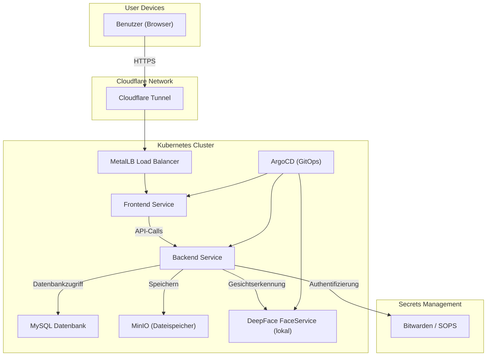

# SEUSAG
Das SEUSAG-Diagramm stellt die Gesamtübersicht der EventGallery-Applikation dar. Es zeigt die Interaktionen zwischen Benutzern, internen Services und externen APIs.

### Systemübersicht

### Beschreibung der Architektur

- **Benutzergeräte**: Benutzer laden über den Browser Selfies hoch und rufen Eventbilder ab.
    
- **Cloudflare Tunnel**: Sichert den externen Zugriff und leitet auf MetalLB weiter.
    
- **Kubernetes Cluster**: Alle Services (Frontend, Backend, FaceService, DB, MinIO) laufen lokal im Cluster.
    
- **FaceService**: Lokaler Microservice zur Gesichtserkennung basierend auf DeepFace.
    
- **MinIO**: Lokaler Ersatz für S3, speichert Eventbilder.
    
- **Bitwarden / SOPS**: Management von Secrets (Datenbankpasswörter, API-Keys).
    
- **ArgoCD**: Automatisiertes Deployment der Services über GitOps.

