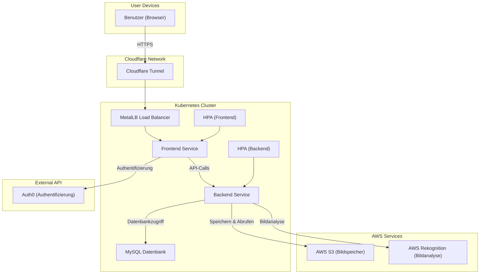

# SEUSAG
Das SEUSAG-Diagramm stellt die Gesamtübersicht der EventGallery-Applikation dar. Es zeigt die Interaktionen zwischen Benutzern, internen Services und externen APIs.

### Systemübersicht

### Beschreibung der Architektur

1. **Benutzergeräte**:
   - Benutzer greifen über den Browser und HTTPS auf die Anwendung zu.

2. **Cloudflare Tunnel**:
   - Leitet Anfragen sicher an MetalLB im Kubernetes-Cluster weiter.

3. **Kubernetes Cluster**:
   - Enthält Frontend- und Backend-Services, MySQL-Datenbank und MetalLB für externe IPs.
   - HPAs übernehmen die automatische Skalierung der Pods.

4. **AWS Services**:
   - **S3**: Speicherung von Bildern.
   - **Rekognition**: Machine-Learning-gestützte Bildanalyse.

5. **Externe API (Auth0)**:
   - Authentifizierung der Benutzer.

