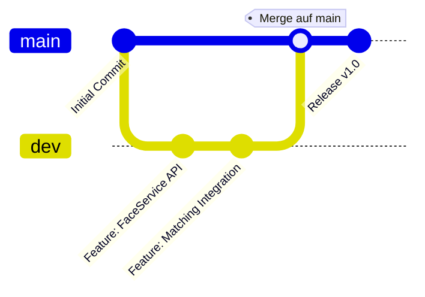

# GitHub Branching Konzept

## Ziel des Branching-Konzepts

Das Branching-Konzept dient der strukturierten, parallelen Entwicklung der EventGallery 2.0 Applikation. Ziel ist es, die Codequalität zu sichern, Konflikte zu minimieren und den Entwicklungsprozess nachvollziehbar zu gestalten.

## Hauptbestandteile des Konzepts

### Main Branch (`main`)

- Enthält den stabilen und produktionsreifen Code.
    
- Änderungen werden nur über Pull Requests aus dem `dev` Branch gemergt.
    
- Jede Änderung muss erfolgreich getestet sein und einem Review unterzogen werden.
    

### Development Branch (`dev`)

- Hauptzweig für aktive Entwicklung und Integration.
    
- Features, Bugfixes und Verbesserungen werden hier zusammengeführt und getestet.
    
- Regelmässige Merges in `main`, sobald stabile Zwischenstände erreicht sind.
    

### Feature Branches

- Neue Features oder grössere Änderungen werden in separaten Branches entwickelt (`feature/<beschreibung>`).
    
- Nach Abschluss eines Features erfolgt ein Pull Request auf `dev`.
    

## Workflow

1. Erstellung eines Feature Branches ab `dev`.
    
2. Entwicklung und lokale Tests des Features.
    
3. Erstellung eines Pull Requests auf `dev`.
    
4. Review und Merge nach bestandenen Tests.
    
5. Zusammenführen von `dev` in `main` nach Abschluss eines stabilen Zwischenstandes.
    
6. Tagging der Releases auf `main`.
    

## Vorteile des Branching-Konzepts

- Strukturierte und nachvollziehbare Entwicklung.
    
- Minimierung von Konflikten durch isolierte Feature-Branches.
    
- Qualitätssicherung durch Pull Requests und Reviews.
    
- Übersichtliche Release-Strategie durch Tagging auf `main`.