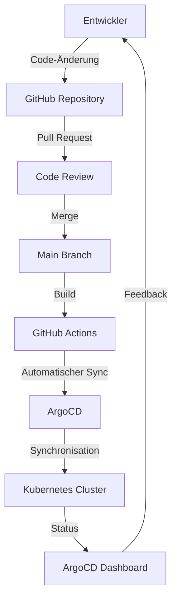

# Architektur des Systems

Dieses Galerieverwaltungssystem basiert auf Kubernetes, einer Technologie, die es ermöglicht, viele kleine Anwendungen effizient zu verwalten. Die Architektur wurde so gestaltet, dass sie leicht erweitert und zuverlässig betrieben werden kann.

## Übersicht der Komponenten

| **Kategorie**                | **Tool/Technologie** |
| ---------------------------- | -------------------- |
| **Container Orchestrierung** | Kubernetes (k0s)     |
| **Infrastruktur**            | MAAS                 |
| **CI/CD**                    | ArgoCD               |
| **Load Balancing**           | MetalLB              |
| **Versionierung**            | GitHub               |
| **Automation**               | Terraform            |
|                              |                      |

## Wie die Komponenten zusammenarbeiten

### Kubernetes Cluster

- Kubernetes sorgt dafür, dass alle Anwendungen (Microservices) im System gut zusammenarbeiten.
    
- **MetalLB** verteilt die eingehenden Anfragen gleichmäßig auf die verfügbaren Computer (Worker-Nodes).
    
- Daten werden sicher in sogenannten "Persistent Volumes" gespeichert, die unabhängig vom laufenden Programm bestehen bleiben.
    

### CI/CD mit ArgoCD

- **ArgoCD** synchronisiert automatisch alle Änderungen aus dem GitHub-Repository mit dem Cluster.
    
- **GitHub Actions** sorgt dafür, dass der Code getestet wird, bevor er auf das System gespielt wird.
    

### Datenfluss

1. Ein Benutzer stellt eine Anfrage, z. B. das Hochladen eines Fotos.
    
2. **MetalLB** leitet die Anfrage an den richtigen Microservice im Cluster weiter.
    
3. Der Microservice verarbeitet die Anfrage und speichert die Daten bei Bedarf.
    
4. Das Ergebnis wird an den Benutzer zurückgeschickt.
    

## Hardware

Das System läuft auf einer modernen Infrastruktur, die mit **MAAS** verwaltet wird. MAAS hilft dabei, mehrere physische Server wie eine Cloud zu verwalten.

- **Cluster Nodes:**
    
    - Die Server, auf denen Kubernetes läuft, werden von MAAS bereitgestellt.
        
- **Netzwerk:**
    
    - **MetalLB** sorgt dafür, dass alle Anfragen effizient verteilt werden.
        

## Kubernetes Controlplane & Worker

Die Architektur wurde so entworfen, dass sie zuverlässig und schnell ist. Es gibt einen Hauptcomputer (Control-Plane) und mehrere Arbeitscomputer (Worker-Nodes):

|                       |               |
| --------------------- | ------------- |
| **Node**              | **Rolle**     |
| **nl-cloud-hf-22-1**  | Control-Plane |
| **nl-cloud-hf-22-w1** | Worker        |
| **nl-cloud-hf-22-w2** | Worker        |
| **nl-cloud-hf-22-w3** | Worker        |

## Visualisierung der Architektur

Das folgende Diagramm zeigt, wie die verschiedenen Teile des Systems miteinander verbunden sind:

## GitOps Flow

Mit dem **GitOps-Flow** werden Änderungen am Code automatisch in das System übernommen. Der Ablauf sieht so aus:

1. Ein Entwickler nimmt eine Änderung im **GitHub Repository** vor.
    
2. Es wird ein **Pull Request** erstellt, und die Änderung wird überprüft.
    
3. Nach erfolgreicher Prüfung wird der Code in den Hauptzweig (Main Branch) übernommen.
    
4. **GitHub Actions** baut den neuen Code und stellt sicher, dass er funktioniert.
    
5. **ArgoCD** synchronisiert den neuen Code mit dem Kubernetes-Cluster.
    
6. Über das **ArgoCD Dashboard** können Entwickler den Status des Systems überwachen und Feedback erhalten.
    

