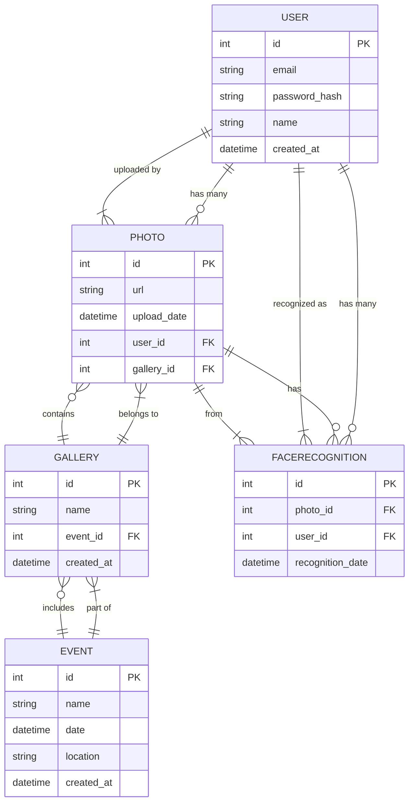

# 3.3 Architektur


## Einführung

Das Datenbankkonzept für das Projekt "MSCV Gallery with Face Matching" umfasst die Hauptentitäten und deren Beziehungen. Die Datenbank ist so gestaltet, dass sie effizient Benutzerinformationen, Fotos, Galerien, Veranstaltungen und Gesichtserkennungsergebnisse speichern und verwalten kann.

## Hauptentitäten und Beziehungen

### Tabellen und Felder

1. **User**
    - `id` (Primary Key)
    - `email`
    - `password
    - `name`
    - `created_at`

2. **Photo**
    - `id` (Primary Key)
    - `url`
    - `upload_date`
    - `user_id` (Foreign Key zu `User.id`)
    - `gallery_id` (Foreign Key zu `Gallery.id`)

3. **Gallery**
    - `id` (Primary Key)
    - `name`
    - `event_id` (Foreign Key zu `Event.id`)
    - `created_at`

4. **Event**
    - `id` (Primary Key)
    - `name`
    - `date`
    - `location`
    - `created_at`

5. **FaceRecognition**
    - `id` (Primary Key)
    - `photo_id` (Foreign Key zu `Photo.id`)
    - `user_id` (Foreign Key zu `User.id`)
    - `recognition_date`

### Entity-Relationship-Diagramm (ERD)



### Beschreibung der Beziehungen

- Ein `User` kann mehrere `Photo`-Einträge haben (1:N Beziehung).
- Ein `Photo` gehört zu einem `User` und zu einer `Gallery` (N:1 Beziehung).
- Eine `Gallery` kann mehrere `Photo`-Einträge enthalten (1:N Beziehung).
- Eine `Gallery` gehört zu einem `Event` (N:1 Beziehung).
- Ein `Event` kann mehrere `Gallery`-Einträge haben (1:N Beziehung).
- Ein `Photo` kann mehrere `FaceRecognition`-Einträge haben (1:N Beziehung).
- Ein `FaceRecognition`-Eintrag gehört zu einem `Photo` und zu einem `User` (N:1 Beziehung).


## SQLAlchemy-Modelle

### models/user.py


```
from datetime import datetime
from app.extensions import db

class User(db.Model):
    __tablename__ = 'users'
    id = db.Column(db.Integer, primary_key=True)
    email = db.Column(db.String(128), unique=True, nullable=False)
    password_hash = db.Column(db.String(256), nullable=False)
    name = db.Column(db.String(128), nullable=False)
    created_at = db.Column(db.DateTime, default=datetime.utcnow)

    photos = db.relationship('Photo', backref='user', lazy=True)
    face_recognitions = db.relationship('FaceRecognition', backref='user', lazy=True)

```


### models/photo.py

```
from datetime import datetime
from app.extensions import db

class Photo(db.Model):
    __tablename__ = 'photos'
    id = db.Column(db.Integer, primary_key=True)
    url = db.Column(db.String(256), nullable=False)
    upload_date = db.Column(db.DateTime, default=datetime.utcnow)
    user_id = db.Column(db.Integer, db.ForeignKey('users.id'), nullable=False)
    gallery_id = db.Column(db.Integer, db.ForeignKey('galleries.id'), nullable=False)

```


### models/gallery.py

python

Code kopieren


```
from datetime import datetime
from app.extensions import db

class Gallery(db.Model):
    __tablename__ = 'galleries'
    id = db.Column(db.Integer, primary_key=True)
    name = db.Column(db.String(128), nullable=False)
    event_id = db.Column(db.Integer, db.ForeignKey('events.id'), nullable=False)
    created_at = db.Column(db.DateTime, default=datetime.utcnow)

    photos = db.relationship('Photo', backref='gallery', lazy=True)

```


### models/event.py

python

Code kopieren


```
from datetime import datetime
from app.extensions import db

class Event(db.Model):
    __tablename__ = 'events'
    id = db.Column(db.Integer, primary_key=True)
    name = db.Column(db.String(128), nullable=False)
    date = db.Column(db.DateTime, nullable=False)
    location = db.Column(db.String(256), nullable=False)
    created_at = db.Column(db.DateTime, default=datetime.utcnow)

    galleries = db.relationship('Gallery', backref='event', lazy=True)

```


### models/face_recognition.py

python

Code kopieren


```
from datetime import datetime
from app.extensions import db

class FaceRecognition(db.Model):
    __tablename__ = 'face_recognitions'
    id = db.Column(db.Integer, primary_key=True)
    photo_id = db.Column(db.Integer, db.ForeignKey('photos.id'), nullable=False)
    user_id = db.Column(db.Integer, db.ForeignKey('users.id'), nullable=False)
    recognition_date = db.Column(db.DateTime, default=datetime.utcnow)

```


