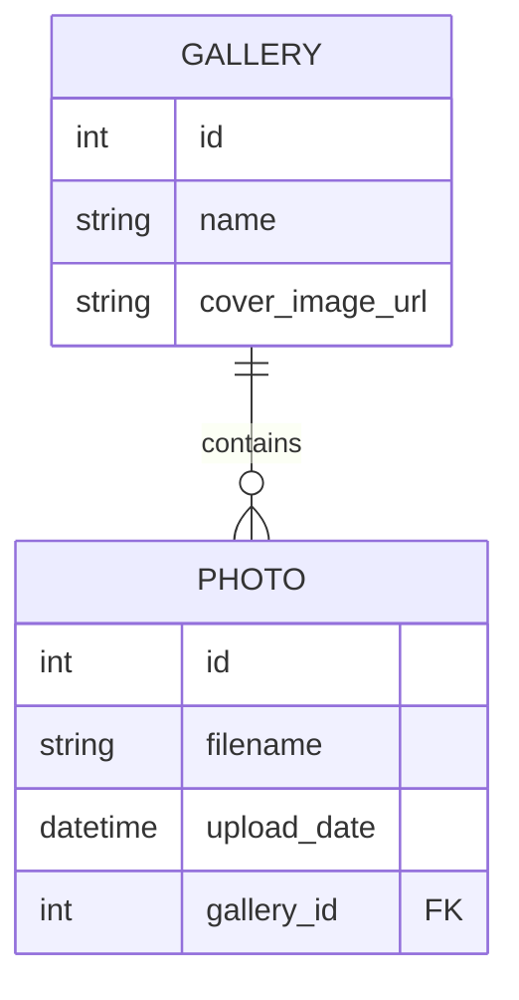

# 3.3 Datenbank-Schema




## Einführung

Das Datenbank-Schema besteht aus zwei Haupttabellen: gallery und photos. Diese Tabellen speichern Informationen über Galerien und die zugehörigen Fotos. Die Beziehung zwischen diesen Tabellen ist eine Ein-zu-Viele-Beziehung, wobei eine Galerie mehrere Fotos enthalten kann, aber jedes Foto gehört nur zu einer Galerie.

## Hauptentitäten und Beziehungen

### Tabellen und Felder

Hier ist die Beschreibung der Tabellen und Felder in Markdown-Format:

### Tabellen und Felder

#### Tabelle: `gallery`

| Feldname          | Typ      | Länge | Null | Beschreibung                                                |
|-------------------|----------|-------|------|-------------------------------------------------------------|
| `id`              | Integer  | -     | Nein | Primärschlüssel der Tabelle. Automatisch generiert und einzigartig für jede Galerie. |
| `name`            | String   | 128   | Nein | Der Name der Galerie. Kann nicht null sein.                  |
| `cover_image_url` | String   | 256   | Ja   | Eine optionale URL, die auf das Cover-Bild der Galerie verweist. Kann null sein. |
| `photos`          | Beziehung| -     | -    | Eine Galerie kann mehrere Fotos enthalten. Dies ist eine Ein-zu-Viele-Beziehung mit der Tabelle `photos`. |

#### Tabelle: `photos`

| Feldname      | Typ      | Länge | Null | Beschreibung                                                |
|---------------|----------|-------|------|-------------------------------------------------------------|
| `id`          | Integer  | -     | Nein | Primärschlüssel der Tabelle. Automatisch generiert und einzigartig für jedes Foto. |
| `filename`    | String   | 256   | Nein | Der Name der Fotodatei. Kann nicht null sein.                |
| `upload_date` | DateTime | -     | Nein | Datum und Uhrzeit, wann das Foto hochgeladen wurde. Standardwert ist die aktuelle Zeit. |
| `gallery_id`  | Integer  | -     | Nein | Ein Fremdschlüssel, der auf den Primärschlüssel `id` der Tabelle `gallery` verweist. Kann nicht null sein. |


### Beschreibung der Beziehungen

- **Gallery to Photos**:
  - Eine Galerie (`Gallery`) kann mehrere Fotos (`Photos`) enthalten.
  - Ein Foto (`Photo`) gehört zu genau einer Galerie (`Gallery`).
  - Dies wird durch den Fremdschlüssel `gallery_id` in der Tabelle `photos` erreicht, der auf das Feld `id` der Tabelle `gallery` verweist.


## SQLAlchemy-Modelle


### models/photo.py

```
from app.extensions import db  
from datetime import datetime  
  
class Photo(db.Model):  
    __tablename__ = 'photos'  
    id = db.Column(db.Integer, primary_key=True)  
    filename = db.Column(db.String(256), nullable=False)  
    upload_date = db.Column(db.DateTime, default=datetime.utcnow)  
    gallery_id = db.Column(db.Integer, db.ForeignKey('gallery.id'), nullable=False)

```


### models/gallery.py


```
from app.extensions import db  
  
class Gallery(db.Model):  
    id = db.Column(db.Integer, primary_key=True)  
    name = db.Column(db.String(128), nullable=False)  
    cover_image_url = db.Column(db.String(256), nullable=True)  
    photos = db.relationship('Photo', backref='gallery', lazy=True)

```


