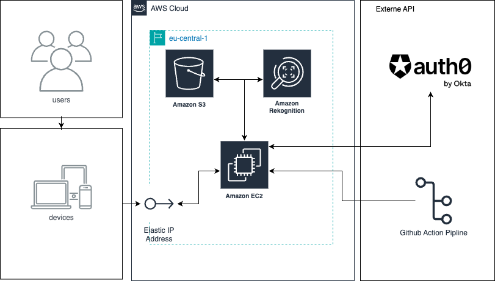

# Einleitung

Die digitalen und interaktiven Bedürfnisse bei Veranstaltungen erfordern eine effiziente Lösung zur schnellen Identifizierung persönlicher Fotos in grossen Galerien. Dieses Projekt entwickelt ein Microservice-basiertes System mit Gesichtserkennung, um dieses Problem zu lösen. Es unterscheidet sich von bestehenden Lösungen durch seine modulare Architektur und die direkte Integration von Gesichtserkennungstechnologien, die speziell auf die Anforderungen von Event-Veranstaltern und Teilnehmern zugeschnitten sind.

## Bedarf
Veranstaltungen erzeugen eine grosse Menge an Fotomaterial, das effizient verwaltet und durchsucht werden muss. Besucher und Teilnehmer benötigen eine schnelle Methode, um sich selbst auf Fotos zu finden, ohne manuell durch Hunderte oder Tausende von Bildern blättern zu müssen.

## Ansatz
Durch die Entwicklung eines microservicebasierten Galerieverwaltungssystems mit integrierter Gesichtserkennung können Nutzer durch einfaches Hochladen eines Selfies alle Fotos finden, auf denen sie abgebildet sind. Dieses System nutzt moderne Cloud-Dienste und Gesichtserkennungstechnologien, um eine skalierbare und effiziente Lösung zu bieten.

## Vorteile
- **Zeitersparnis:** Die Nutzer können ihre persönlichen Fotos schnell finden, was ihre Zufriedenheit erhöht.
- **Verbesserte Interaktion:** Die einfache und schnelle Suche motiviert die Teilnehmer, ihre Fotos zu teilen, was die Interaktionsrate auf der Webseite erhöht.
- **Anpassungsfähigkeit:** Die Microservice-Architektur ermöglicht eine einfache Anpassung an verschiedene Veranstaltungstypen und -grössen.
- **Datenschutz:** Alle Fotos und Gesichtsmerkmale werden sicher gespeichert und datenschutzkonform behandelt.

## Wettbewerb
Aktuelle Lösungen erfordern oft manuelles Durchsuchen der Galerien oder bieten keine spezifische, nutzerfreundliche Suche basierend auf Gesichtserkennung. Dieses System stellt eine direkte Verbesserung dar, indem es eine intuitive, effektive und schnelle Suche ermöglicht und sich leicht an verschiedene Veranstaltungsgrössen anpassen lässt.

## Praxisbeispiel mit Zahlen und Fakten

**Event:** Musikfestival mit 10.000 Teilnehmern  
**Fotos:** 10.000 Fotos wurden während des Events gemacht

### Aktuelle Situation
- Viele Teilnehmer machen sich nicht die Mühe, ihre Fotos manuell zu suchen, da es zu zeitaufwendig ist. Dadurch gehen viele wertvolle Erinnerungen verloren und die Interaktionsrate auf der Webseite bleibt niedrig.

### Mit dem neuen System
- Teilnehmer laden ein Selfie hoch.
- Das System analysiert das Selfie und zeigt innerhalb von 30 Sekunden alle relevanten Fotos an.
- Die einfache und schnelle Suche motiviert mehr Teilnehmer, ihre Fotos zu finden und zu teilen.

### Ergebnis
- **Erhöhte Nutzerzufriedenheit:** Teilnehmer können ihre persönlichen Fotos schnell und unkompliziert finden, was zu einer höheren Zufriedenheit führt.
- **Steigerung der Interaktionsrate:** Durch die leichtere Zugänglichkeit der Fotos steigt die Wahrscheinlichkeit, dass Teilnehmer ihre Bilder auf Social Media teilen.
- **Verbesserte Veranstaltungswahrnehmung:** Die Möglichkeit, leicht an persönliche Fotos zu gelangen, verbessert das gesamte Veranstaltungserlebnis und hinterlässt einen positiven Eindruck bei den Teilnehmern.

## Nutzen
- **Verbesserte Nutzererfahrung:** Das System bietet eine schnelle und präzise Fotosuche, wodurch das Erlebnis für die Teilnehmer angenehmer und interaktiver wird.
- **Erhöhte Teilungsrate:** Da die Teilnehmer ihre Fotos leichter finden und teilen können, steigt die Wahrscheinlichkeit, dass sie die Fotos auf Social Media teilen, was die Sichtbarkeit und Reichweite der Veranstaltung erhöht.
- **Effiziente Verwaltung:** Veranstalter können eine grosse Menge an Fotos effizient verwalten und sicherstellen, dass die Teilnehmer ihre persönlichen Fotos schnell und einfach finden können.
